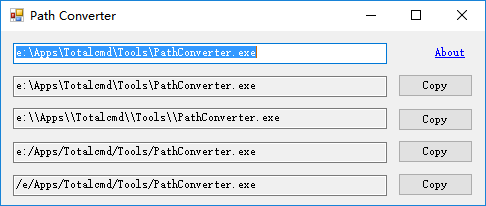

# PathConverter

Convert path delimiters



[download](http://pan.baidu.com/s/1miqIlO8)

**Note:** .Net Framework 4.6.2 is needed, if your Windows is older than Windows 10 Anniversary Update,
you need to [download and install it](https://www.microsoft.com/net/download/framework).

## Total Commander

usercmd.ini

```ini
[em_PathConverter]
cmd=%Commander_Path%\Tools\PathConverter.exe
```

wincmd.ini

```ini
[Shortcuts]
C+1=cm_CopySrcPathToClip
C+2=cm_CopyNamesToClip
C+3=cm_CopyFullNamesToClip
C+4=em_PathConverter
```

1. select a file in Total Commander
2. press `ctrl+3` to copy its full name
3. press `ctrl+4` to open this application and convert the copied path
4. press `esc` to exit this application

## License

MIT (c) Ivan Yan
